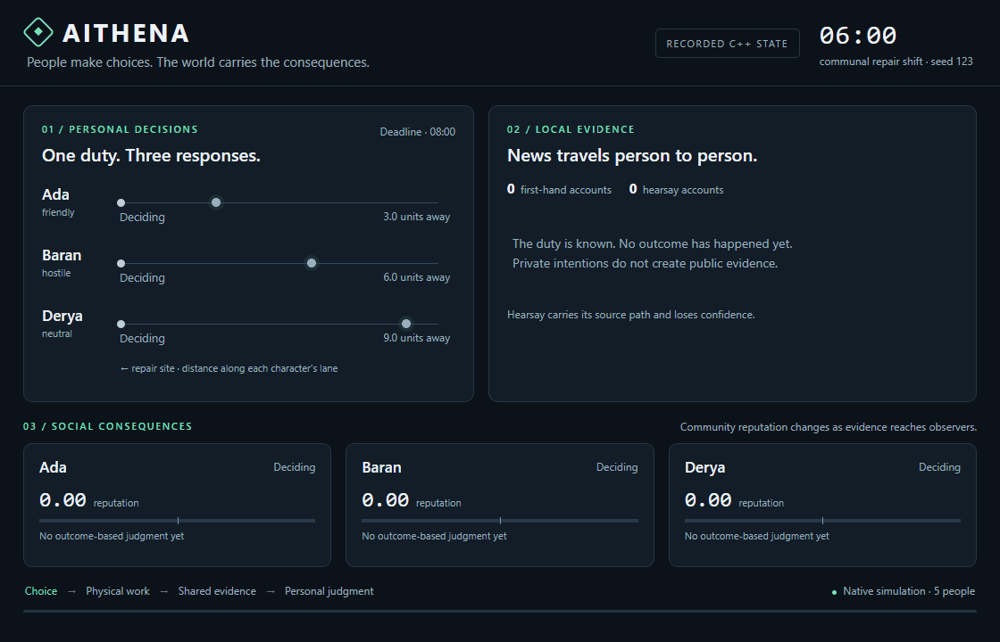
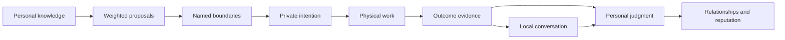

# Aithena

C++17 NPC simulation with explicit decision boundaries and local social consequences.

[](https://github.com/sa-aris/aithena/actions/workflows/ci.yml)
[](https://github.com/sa-aris/aithena/releases/tag/v2.0.0)
[](https://en.cppreference.com/w/cpp/17)
[](#verification)
[](LICENSE)

The latest release is [v2.0.0](https://github.com/sa-aris/aithena/releases/tag/v2.0.0). See the [changelog](CHANGELOG.md#200--2026-10-08) and [migration guidance](#integration) when upgrading from 1.1.

Aithena gives game characters personal knowledge, finite resources, relationships, memory, and responsibilities. Policies propose what a character might do; boundaries determine what the world permits. Choices can vary while their causes and consequences stay coherent.

The core uses the C++ standard library. Lua scripting, C bindings, and the WebAssembly demo are optional. Individual simulation modules are header-only; the composed `NPC` and `GameWorld` runtime links against `npc_lib`.

[Quick start](#quick-start) · [Decision model](#decision-model) · [Systems](#systems) · [Integration](#integration) · [Benchmarks](#benchmarks)

[](examples/social_contract_demo.cpp)

*4K preview (3840 × 2160), recorded from the C++ communal repair scenario with seed `123`. Private intentions, physical progress, evidence paths, and reputation are visualized separately.*

Run the scenario with `./build/social_contract_demo 123`. The [browser village demo](https://sa-aris.github.io/aithena/) provides an interactive view of emotions, memory decay, and social influence chains.

## Quick start

Requirements: a C++17 compiler and CMake 3.16 or newer.

```sh
git clone https://github.com/sa-aris/aithena.git
cd aithena
cmake -S . -B build -DCMAKE_BUILD_TYPE=Release -DNPC_LUA_BRIDGE=OFF
cmake --build build --parallel
ctest --test-dir build --output-on-failure
./build/social_contract_demo 123
```

On Windows, executable names end in `.exe`. Multi-configuration generators use `cmake --build build --config Release` and `ctest --test-dir build -C Release`; executables are normally under `build/Release/`.

The social demo follows five people around a communal repair duty. Changing its seed changes admissible choices. The village demo exercises the broader framework:

```sh
./build/social_contract_demo 7
./build/social_contract_demo 42
./build/village_sim
```

## Decision model

An intention, an action, and someone else's account of that action are separate state.



`DecisionBoundary` evaluates proposals against named, read-only guards. Rejected options retain their reasons. Valid options enter a weighted draw keyed by seed, cause, participants, and action ID. Reordering proposals or consuming randomness elsewhere does not shift that decision's draw.

`SocialContractSystem` applies this model to requests, promises, appointments, and customary duties:

- **Knowledge:** a person must learn about a duty with enough notice. Opening a duty does not give every character knowledge of it.
- **Intent:** fulfillment reserves effort; a private refusal remains private until the deadline. Remote support is a separate action with partial credit.
- **Work:** arrival, availability, resources, personal limits, and host-defined prerequisites are rechecked. Sustained work takes time, and interruptions reset progress.
- **Evidence:** outcomes reach people through direct knowledge or nearby conversation. Reports carry confidence, versions, and acyclic source paths. Conversations have finite attention.
- **Judgment:** responsibility and sympathy shape each observer's response. Repeated reports cannot apply the same contribution twice. Verified corrections retract the earlier contribution, including when a displayed score has reached its limit.

The host supplies the situations, perception inputs, and game rules. The framework supplies the constraints and state transitions. See the [architecture and integration guide](docs/social-boundaries.md) for the contracts, save format, capacity limits, and scheduling model.

## A small social world

```cpp
#include "npc/npc.hpp"
#include "npc/world/world.hpp"
#include <iostream>
#include <memory>

int main() {
    npc::GameWorld world(24, 12);

    auto alice = std::make_shared<npc::NPC>(1, "Alice", npc::NPCType::Villager);
    auto morgan = std::make_shared<npc::NPC>(2, "Morgan", npc::NPCType::Villager);
    alice->position = {5, 4};
    morgan->position = {2, 4};
    alice->verbose = morgan->verbose = false;
    world.addNPC(alice);
    world.addNPC(morgan);
    world.enableSocialSimulation();

    auto& social = world.social();
    social.setSeed(123);
    social.relationships().setValue("Alice", "Morgan", 65);

    npc::SocialContract duty;
    duty.id = 100;
    duty.actor = alice->id;
    duty.beneficiary = morgan->id;
    duty.topic = "repair the shared fence";
    duty.openedAt = social.time();
    duty.deadline = social.time() + 2.0;
    duty.workDuration = 0.25;
    if (!social.open(duty) || !social.inform(alice->id, duty.id)) return 1;

    // Time is expressed in game hours: 0.1 = six game minutes.
    for (int i = 0; i < 60; ++i) world.update(0.1f);
    std::cout << npc::contractPhaseName(social.contract(duty.id)->phase) << '\n';
}
```

The world adapter connects intentions to movement, stamina, memories, and typed `SocialEvent` values. Combat, urgent needs, or a `social_available` blackboard flag can pause participation. Social simulation is opt-in, so existing FSM, behavior tree, utility, and GOAP setups can remain in use.

## Systems

Components are designed for direct use as well as composition. Shared world systems are connected through explicit references, callbacks, and the typed event bus.

| Area | Components |
| --- | --- |
| Decisions | Finite state machines, behavior trees, utility scoring, GOAP, decision boundaries, local/shared blackboards |
| Perception | Sight and hearing, line-of-sight checks, remembered observations, spatial sound events |
| Memory and emotion | Episodic memories, decay stages, hearsay reliability, emotions, needs, emotional contagion |
| Navigation | A*, connected regions, path caching, waypoint graphs, path smoothing, steering |
| Social simulation | Contracts, evidence propagation, relationships and history, reputation, witnessed crimes, factions, formations |
| Living world | Economy and production chains, caravans, procedural quests, families, aging, inheritance |
| Character behavior | Combat, trade, daily schedules, dialogue, quests, skills and perks |
| World runtime | Clock and calendar, weather, events, spatial queries, LOD, NPC spawn/despawn |
| Persistence | JSON, NPC snapshots, world save sections, versioned social snapshots |
| Optional integrations | Lua 5.4, C ABI, WebAssembly, thread-safe wrappers and background task scheduling |

Browse the implementations in [include/npc](include/npc), the [examples](examples), and the [changelog](CHANGELOG.md).

## Integration

### C++

For the composed runtime, add Aithena to a CMake project and link its library:

```cmake
add_subdirectory(path/to/aithena aithena-build)
target_link_libraries(your_game PRIVATE npc_lib)
```

For a standalone module such as `DecisionBoundary` or `SocialContractSystem`, add `include/` to your include path. These modules need no Aithena translation units.

When migrating from 1.1 to 2.0, keep `GameWorld` at a stable address. Copying and moving are disabled because its hooks refer to the world; use a `std::unique_ptr<GameWorld>` if ownership must move. Keep the world alive longer than its `SimulationManager`. Social state is single-threaded; serialize access to it. Parallel background ticking and thread-safe wrappers are separate, optional facilities.

### Lua

Install Lua 5.4 development headers and libraries, then enable the bridge:

```sh
cmake -S . -B build-lua -DCMAKE_BUILD_TYPE=Release -DNPC_LUA_BRIDGE=ON
cmake --build build-lua --target lua_village --parallel
./build-lua/lua_village examples/scripts
```

On Ubuntu, the development package is `liblua5.4-dev`. If Lua is unavailable, CMake reports it and skips the bridge. See the [Lua example](examples/lua_village.cpp) and [behavior scripts](examples/scripts).

### C ABI

Build a shared library for engines that support native C bindings:

```sh
cmake -S . -B build-capi -DCMAKE_BUILD_TYPE=Release -DNPC_LUA_BRIDGE=OFF -DNPC_SHARED=ON
cmake --build build-capi --target npc_shared --parallel
```

The outputs are `libnpc_shared.so` on Linux, `libnpc_shared.dylib` on macOS, and `npc_shared.dll` on Windows. The [C header](include/npc/npc_capi.h) exposes world/NPC lifecycle, movement, combat, emotions, memories, FSM callbacks, blackboards, and relationship queries. Use P/Invoke in Unity, native bindings in Unreal, or GDExtension in Godot. The social-contract module is currently a C++ interface.

### WebAssembly

With an Emscripten SDK configured:

```sh
emcmake cmake -S . -B build-wasm -DCMAKE_BUILD_TYPE=Release -DNPC_LUA_BRIDGE=OFF
cmake --build build-wasm --target npc_wasm --parallel
```

[web/index.html](web/index.html) consumes the generated `npc_wasm.js` and `npc_wasm.wasm`. Serve all three files from the same directory over HTTP. The [Pages workflow](.github/workflows/pages.yml) builds and deploys this browser demo.

### Save and load

`NpcSerializer` handles individual NPC state. `WorldSaveGame` combines shared systems and custom sections. `SocialSerializer` persists contracts, unfinished work, evidence, reservations, and opinion ledgers; a malformed social snapshot leaves that section's current state intact. See [save integration](docs/social-boundaries.md#save-and-load).

## Verification

The current native suites contain **203 unit tests**, plus a social-demo smoke check:

| Suite | Tests | Focus |
| --- | ---: | --- |
| `run_tests` | 137 | Existing components and living-world systems |
| `social_contract_tests` | 40 | Boundaries, resources, sustained work, evidence, gossip, correction |
| `social_world_tests` | 11 | Movement, stamina, urgent needs, LOD, lifecycle, core fixes |
| `social_save_tests` | 15 | Save validation, pending work, evidence paths, opinion ledgers, JSON |

Use CTest to run every configured test target. Lua-enabled builds also register a Lua smoke check. The [CI workflow](.github/workflows/ci.yml) defines GCC 12, Clang 15, and macOS jobs. The latest local native validation used GCC 16.2 on Windows; configured CI platforms should be verified through their workflow results.

## Benchmarks

```sh
cmake -S . -B build-bench -DCMAKE_BUILD_TYPE=Release -DNPC_LUA_BRIDGE=OFF -DNPC_BENCHMARKS=ON
cmake --build build-bench --target run_benchmarks social_benchmarks --parallel
./build-bench/run_benchmarks --quick
./build-bench/social_benchmarks
```

The social benchmark measures decision/resolution work and ten conversation waves separately. A local Release run with GCC 16.2 on Windows produced:

| People | Decisions and resolution | Ten conversation waves |
| ---: | ---: | ---: |
| 64 | 0.540 ms | 12.128 ms |
| 256 | 2.266 ms | 177.642 ms |
| 1,024 | 16.366 ms | 983.180 ms |

These are subsystem timings with the default eight-topic conversation limit; setup time is excluded. They are not full-game frame rates. The composed NPC update includes pairwise perception and emotion work, so active population, update cadence, and LOD policy remain important. Measure with your own scenario and hardware.

## Project layout

| Path | Purpose |
| --- | --- |
| [include/npc](include/npc) | Public C++ components and C ABI header |
| [src](src) | Composed runtime and optional Lua, C ABI, and WASM implementations |
| [examples](examples) | Village, social-contract, and Lua examples |
| [docs/social-boundaries.md](docs/social-boundaries.md) | Social architecture, host contracts, limits, persistence |
| [tests](tests) | Component, social, world, and save regression suites |
| [benchmarks](benchmarks) | Runtime and social-subsystem measurements |
| [web](web) | Browser village demo |

## License and contact

Aithena is available under the [MIT License](LICENSE). See [CHANGELOG.md](CHANGELOG.md) for release history.

Questions and project feedback: [solus.aris@proton.me](mailto:solus.aris@proton.me).
