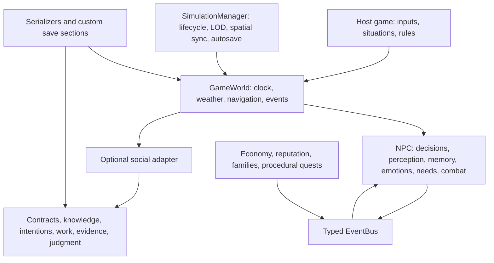
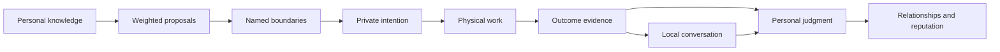

# Aithena

**Coherent characters. Evolving worlds.**

A modular C++17 framework for NPC decisions, perception, memory, relationships, and living-world simulation.

[](https://github.com/sa-aris/aithena/actions/workflows/ci.yml)
[](https://github.com/sa-aris/aithena/releases/tag/v2.0.2)
[](https://sa-aris.github.io/aithena/)
[](https://en.cppreference.com/w/cpp/17)
[](#webassembly)
[](#lua-scripting)
[](#c-abi-and-engine-bindings)
[](#verification)
[](LICENSE)

Aithena gives characters personal knowledge, finite resources, changing emotions, remembered experiences, and responsibilities. Policies propose what someone might do; explicit boundaries determine what the world permits. Actions can vary while their causes and consequences stay coherent.

Use individual header-only modules in an existing game, or compose them through `NPC`, `GameWorld`, and `SimulationManager`. The core uses the C++ standard library. Lua scripting, native C bindings, background workers, and the WebAssembly demo are optional.

[](examples/social_contract_demo.cpp)

*Native 4K animation: 3840 × 2160, recorded from the C++ communal repair scenario with seed `123`. It visualizes private intentions, physical progress, evidence paths, and reputation.*

The latest release is [v2.0.2](https://github.com/sa-aris/aithena/releases/tag/v2.0.2). See the [changelog](CHANGELOG.md#202--2026-10-08) and [migration guidance](#migration-from-11).

## Contents

- [Quick start](#quick-start)
- [Demos](#demos)
- [Architecture](#architecture)
- [Decision boundaries and social consequences](#decision-boundaries-and-social-consequences)
- [Systems](#systems)
- [Build options](#build-options)
- [C++ integration](#c-integration)
- [Lua scripting](#lua-scripting)
- [C ABI and engine bindings](#c-abi-and-engine-bindings)
- [WebAssembly](#webassembly)
- [Persistence](#persistence)
- [Threading and lifetime](#threading-and-lifetime)
- [Verification](#verification)
- [Benchmarks](#benchmarks)
- [Project layout](#project-layout)
- [License and contact](#license-and-contact)

## Quick start

Requirements: a C++17 compiler and CMake 3.16 or newer. Native shared-library builds also require a C compiler for the C99 consumer check.

```sh
git clone https://github.com/sa-aris/aithena.git
cd aithena
cmake -S . -B build -DCMAKE_BUILD_TYPE=Release -DNPC_LUA_BRIDGE=OFF
cmake --build build --parallel
ctest --test-dir build --output-on-failure
./build/social_contract_demo 123
```

`ctest --test-dir` requires CMake 3.20. With an older version, run `ctest --output-on-failure` from the build directory. See the [CTest command reference](https://cmake.org/cmake/help/latest/manual/ctest.1.html).

On Windows, executables end in `.exe`. Visual Studio and other multi-configuration generators use:

```sh
cmake -S . -B build -DNPC_LUA_BRIDGE=OFF
cmake --build build --config Release --parallel
ctest --test-dir build -C Release --output-on-failure
./build/Release/social_contract_demo.exe 123
```

The CLI examples use **game hours** for simulation time. A step of `0.1` advances six game minutes. Convert real elapsed seconds into game hours at the speed your game needs.

## Demos

| Demo | Run | What it demonstrates |
| --- | --- | --- |
| [Social contracts](examples/social_contract_demo.cpp) | `./build/social_contract_demo 123` | Five residents, a shared repair duty, private choices, sustained work, local reports, and consequences |
| [Village simulation](examples/village_sim.cpp) | `./build/village_sim` | Scheduled work, trade, combat, emotional contagion, memory decay, influence chains, economy, crimes, quests, and save/load |
| [Lua village](examples/lua_village.cpp) | `./build-lua/lua_village examples/scripts` | Guard and merchant behavior defined in Lua and connected to C++ FSM states |
| [Browser village](https://sa-aris.github.io/aithena/) | Open in a browser | Five NPC cards, emotional state, memory strength, influence chains, and a chronological event log |

The browser demo has play/pause, reset, and speed controls. It is a separate village scene from the social-contract animation. [Pages workflow results](https://github.com/sa-aris/aithena/actions/workflows/pages.yml) show the deployed build's status.

Run `social_contract_demo 7` or `social_contract_demo 42` to explore other choices. The same social seed and causal inputs reproduce the same keyed decisions; the broader runtime also has its own mutable random generator.

## Architecture

The framework separates character state, shared world state, and optional host adapters. Components communicate through typed events, explicit references, and callbacks.



`NPC` composes character behavior modules. `GameWorld` supplies shared time, locations, obstacles, relationships, factions, and events. `SimulationManager` adds spawn/despawn ownership, scoped subscriptions, LOD scheduling, spatial indexing, and autosave. Living-world modules can be used independently and wired into a game's systems, as the village example does.

The host controls presentation, physics, content, and perception inputs. There is no engine-specific renderer or universal story script inside the core. State machines, behavior trees, utility scoring, GOAP, and social policies can coexist.

## Decision boundaries and social consequences

An intention, a completed action, and someone else's account of that action are separate state.



[`DecisionBoundary`](include/npc/ai/decision_boundary.hpp) evaluates proposals against named, read-only guards. Rejected options retain their reasons. Admissible options enter a weighted draw keyed by seed, cause, participants, and action ID. Reordering proposals or consuming randomness elsewhere does not shift that decision's draw. Stable identifiers and consistent causal inputs are part of the host contract.

[`SocialContractSystem`](include/npc/social/social_contract_system.hpp) applies those boundaries to requests, promises, appointments, and customary duties:

| Stage | Constraint | Consequence |
| --- | --- | --- |
| Knowledge | The actor must learn about a duty with enough notice | Opening a duty does not make everyone aware of it |
| Intention | Available effort, relationships, traits, and policy shape admissible choices | Fulfillment reserves effort; a refusal remains private until the deadline |
| Work | Arrival, availability, resources, personal limits, and host prerequisites are rechecked | Travel and sustained work take time; interruptions reset progress |
| Evidence | Outcomes spread through direct knowledge or nearby conversation | Reports carry confidence, versions, source paths, and hop limits |
| Judgment | Each observer evaluates responsibility and sympathy | Repeated reports do not apply the same contribution twice |
| Correction | Verified evidence replaces an earlier account | The earlier opinion contribution is retracted, even when a displayed score reached its limit |

Remote support is a separate action with partial credit. An absent actor is not automatically treated as a malicious actor. A private refusal is not immediately revealed to the whole village. Finite conversation attention and bounded queues keep knowledge local and processing controlled.

### A small social world

```cpp
#include "npc/npc.hpp"
#include "npc/world/world.hpp"
#include <iostream>
#include <memory>

int main() {
    npc::GameWorld world(24, 12);
    auto alice = std::make_shared<npc::NPC>(1, "Alice", npc::NPCType::Villager);
    auto morgan = std::make_shared<npc::NPC>(2, "Morgan", npc::NPCType::Villager);
    alice->position = {5, 4};
    morgan->position = {2, 4};
    alice->verbose = morgan->verbose = false;
    world.addNPC(alice);
    world.addNPC(morgan);
    world.enableSocialSimulation();

    auto& social = world.social();
    social.setSeed(123);
    social.relationships().setValue("Alice", "Morgan", 65);

    npc::SocialContract duty;
    duty.id = 100;
    duty.actor = alice->id;
    duty.beneficiary = morgan->id;
    duty.topic = "repair the shared fence";
    duty.openedAt = social.time();
    duty.deadline = social.time() + 2.0;
    duty.workDuration = 0.25;
    if (!social.open(duty) || !social.inform(alice->id, duty.id)) return 1;

    for (int i = 0; i < 60; ++i) world.update(0.1f);
    std::cout << npc::contractPhaseName(social.contract(duty.id)->phase) << '\n';
}
```

The world adapter connects intentions to movement, stamina, memories, and typed `SocialEvent` values. Combat, urgent needs, or the `social_available` blackboard flag can pause participation. Social simulation is opt-in.

The [social architecture guide](docs/social-boundaries.md) documents guards, proposal hooks, time and identity rules, physical prerequisites, capacity limits, scheduling, persistence, and a complete host integration.

## Systems

### Decisions and blackboards

**[Finite state machines](include/npc/ai/fsm.hpp)** provide named states, enter/update/exit hooks, guarded transitions, and priority ordering. Behavior can be defined in native callbacks or through the optional Lua bridge.

**[Behavior trees](include/npc/ai/behavior_tree.hpp)** provide sequences, selectors, parallel nodes, weighted random selectors, actions, conditions, services, timeouts, retries, and decorators. A fluent builder composes trees; `debugSnapshot()` and `debugString()` expose node structure, tick counts, and the last status for editor tooling.

```cpp
#include "npc/ai/behavior_tree.hpp"
#include <iostream>

int main() {
    npc::Blackboard blackboard;
    blackboard.set("enemy_visible", true);
    auto tree = npc::BehaviorTreeBuilder()
        .selector()
            .sequence()
                .condition("enemy_visible", [](const npc::Blackboard& bb) {
                    return bb.getOr<bool>("enemy_visible", false);
                })
                .action("attack", [](npc::Blackboard& bb) {
                    bb.set("chosen_action", std::string("attack"));
                    return npc::NodeStatus::Success;
                })
            .end()
            .action("patrol", [](npc::Blackboard&) {
                return npc::NodeStatus::Running;
            })
        .end()
        .build();
    if (tree.tick(blackboard) != npc::NodeStatus::Success) return 1;
    std::cout << tree.debugString();
}
```

**[Utility scoring](include/npc/ai/utility_ai.hpp)** combines considerations and response curves to rank actions. **[GOAP](include/npc/ai/goap.hpp)** plans action sequences from preconditions, effects, goals, and costs, including dynamic cost callbacks. These are alternatives for proposing behavior; named boundaries can constrain the resulting choices.

**[Local blackboards](include/npc/ai/blackboard.hpp)** hold character state. **[Shared blackboards](include/npc/ai/shared_blackboard.hpp)** add TTL expiry, version counters, prefix watchers, a world-state facade, and synchronization into local state. Watchers are explicit hooks for responding to changed world conditions.

### Perception, memory, emotion, and needs

**[Perception](include/npc/perception/perception_system.hpp)** combines sight cones, hearing, configurable range, line-of-sight checks, and stale observations. **[Sound perception](include/npc/perception/sound_perception.hpp)** models discrete noise sources, distance and wall attenuation, uncertain position estimates, and investigation targets.

**[Memory](include/npc/memory/memory_system.hpp)** stores time-stamped episodes with importance, emotional impact, strength, and reliability. Fade events distinguish fading, nearly forgotten, and forgotten memories. Hearsay received through `receiveGossip()` decays faster than direct experience and can lose reliability as it spreads.

**[Emotion and needs](include/npc/emotion/emotion_system.hpp)** model seven emotions and seven needs, with decay, recovery, dominant mood, and personality-sensitive emotional contagion. The runtime uses these signals in combat, trade, and activity selection. **[Personality traits](include/npc/personality/personality_traits.hpp)** shape individual responses rather than giving every NPC identical thresholds.

The village demo shows contagion, memory fade events, and influence paths. The host decides which observations and reports become memories; characters do not automatically know every world event.

### Navigation and movement

**[Pathfinding](include/npc/navigation/pathfinding.hpp)** includes grid A*, search budgets, partial paths, connected navigation regions, an LRU path cache, waypoint graphs, smoothing, and prioritized request queues. Region checks can reject disconnected routes before running a search. Rebuild regions and invalidate cached routes when host-defined walkability changes.

**[Steering](include/npc/navigation/steering.hpp)** produces forces for seeking, arrival, separation, time-to-collision avoidance, obstacle avoidance, queue following, and related movement behaviors. It also supplies overlap resolution. Blend those outputs with your movement and physics rules.

**[Spatial queries](include/npc/world/spatial_index.hpp)** combine a hash grid and quadtree with radius, rectangle, nearest-neighbor, exclusion, and cluster queries. Query cost depends on density, radius, and index choice.

### Relationships, influence, reputation, and factions

**[Relationships](include/npc/social/relationship_system.hpp)** form a directed graph with value, trust, decay, and typed interaction history. Saved, betrayed, helped, attacked, gifted, and other events can be recalled as short narrative descriptions.

```cpp
#include "npc/social/relationship_system.hpp"
#include <iostream>

int main() {
    npc::RelationshipSystem relationships;
    relationships.recordEvent("Alice", "Morgan", npc::RelationshipEventType::Saved, 12.0f);
    auto memory = relationships.recallSentence(
        "Morgan", "Alice", npc::RelationshipEventType::Saved, 36.0f);
    if (memory) std::cout << *memory << '\n';
    std::cout << relationships.narrative("Morgan", "Alice", 36.0f) << '\n';
}
```

The record captures Alice's action on Morgan. Morgan's reverse relationship is independent; the host can update reciprocal reactions when the situation calls for them.

**[Influence chains](include/npc/social/influence_chain.hpp)** track messages, origins, charge, reliability, and propagation hops. They support game-defined rumor and belief mechanics. Social contracts use a separate versioned evidence model so corrections and personal judgments remain tied to a specific outcome.

**[Reputation and crime](include/npc/social/reputation_system.hpp)** distinguish community standing from one-to-one relationships. Crime records track witnesses, reports, unsolved cases, severity, and bounties. `onCrimeWitnessed` lets the host connect reports to memories or events. For assault, theft, and pickpocketing, a named victim also counts as a witness.

**[Factions](include/npc/social/faction_system.hpp)** support peace, alliances, war, trade, vassalage, and time-limited truces. Coalition resolution and war cascades follow configured alliance and vassal links.

**[Group behavior](include/npc/social/group_behavior.hpp)** supplies formations, tactical roles, flanking, encirclement, retreat assignments, and shared morale. Encirclement follows the approach direction; rally recovery is proportional to elapsed game time.

### Economy, families, and procedural quests

**[Economy](include/npc/economy/economy_system.hpp)** models settlement production chains, labor, inputs, stockpiles, population consumption, scarcity-sensitive prices, and caravans between markets. Connect it to **[trade](include/npc/trade/trade_system.hpp)** for merchant inventory, pricing, negotiation, barter, and relationship effects.

**[Families and lifecycle](include/npc/social/family_system.hpp)** model households, marriage, kinship checks, children, aging, mortality, and inheritance. Drainable lifecycle events let the host connect these changes to the rest of the simulation.

**[Procedural quests](include/npc/quest/quest_generator.hpp)** turn configured world state into bounty hunts, supply runs, mediation, gifts, and caravan escorts. Situation fingerprints prevent repeated generation of the same source situation. `releaseContext()` makes a situation eligible again when your game needs it.

```cpp
#include "npc/quest/quest_generator.hpp"
#include <iostream>

int main() {
    npc::RelationshipSystem relationships;
    relationships.setValue("Alice", "Ben", -70);
    relationships.setValue("Ben", "Alice", -70);
    npc::QuestManager board;
    npc::QuestGenerator generator;
    generator.relationships = &relationships;
    auto quests = generator.generateInto(board, 12.0, 4);
    std::cout << "New quests: " << quests.size() << '\n';
    return quests.empty() ? 1 : 0;
}
```

### Combat, schedules, dialogue, quests, and skills

**[Combat](include/npc/combat/combat_system.hpp)** covers threat assessment, target selection, abilities, cooldowns, damage resistances, health, stamina, mana, and personality-dependent flee thresholds.

**[Schedules](include/npc/schedule/schedule_system.hpp)** combine weekly activity windows, locations, priority, fatigue, sickness, overrides, and travel estimates. Travel feasibility uses the time remaining in the current activity window, including overnight schedules.

**[Dialogue](include/npc/dialog/dialog_system.hpp)** provides branching nodes, reputation and mood gates, story flags, skill checks, relationship effects, and success/failure transitions. Use the context-aware `selectOption()` overload to recheck gates at selection time. The legacy index-only overload is intended for callers managing their own filtering.

**[Quests](include/npc/quest/quest_system.hpp)** manage prerequisites, acceptance, objectives, repeatability, chains, rewards, and completion/failure events. **[Skills](include/npc/skill/skill_system.hpp)** track six domains, XP, levels, perks, and bonuses. Event subscriptions can award skill experience from character activity.

### Clock, weather, world events, and LOD

**[Time](include/npc/world/time_system.hpp)** provides game hours and a calendar. **[Weather](include/npc/world/weather_system.hpp)** updates environmental conditions and publishes changes. **[World events](include/npc/world/world_event_manager.hpp)** support timed situations and their effects.

**[LOD](include/npc/world/lod_system.hpp)** classifies characters as Active, Background, or Dormant using distance and importance. Hysteresis reduces flicker; accumulated delta time preserves elapsed simulation time between reduced-frequency ticks. **[SimulationManager](include/npc/world/simulation_manager.hpp)** coordinates these updates with lifecycle and spatial synchronization.

### Typed events

**[EventBus](include/npc/event/event_system.hpp)** supports typed subscriptions, priorities, filters, delayed dispatch, transforms between event types, scoped subscription groups, and bounded history.

```cpp
#include "npc/event/event_system.hpp"
#include <iostream>

int main() {
    npc::EventBus events;
    int trades = 0;
    {
        auto subscription = events.subscribeScoped<npc::TradeEvent>(
            [&](const npc::TradeEvent&) { ++trades; });
        events.publish(npc::TradeEvent{1, 2, 1, 1, 5});
    }
    events.publish(npc::TradeEvent{1, 2, 1, 1, 5});
    std::cout << "Observed trades: " << trades << '\n';
    return trades == 1 ? 0 : 1;
}
```

Keep the bus alive longer than its scoped subscriptions. Delayed dispatch uses the bus's absolute clock, so pass monotonically increasing simulation time to `EventBus::update()`.

## Build options

| Option | Default | Effect |
| --- | --- | --- |
| `NPC_LUA_BRIDGE` | `ON` | Build `npc_lua` and `lua_village` if Lua 5.4 development files are found; disabled for Emscripten |
| `NPC_SHARED` | `OFF` | Build the native C ABI shared library, C ABI tests, and a C99 consumer smoke check |
| `NPC_BENCHMARKS` | `OFF` | Build runtime and social-subsystem benchmarks |
| `NPC_HEADER_CHECKS` | `OFF` | Compile all 48 public C++ headers individually to verify standalone includes |

The standard build includes `npc_lib`, `village_sim`, `social_contract_demo`, and the core test executables. Emscripten additionally exposes `npc_wasm`.

To validate all optional native components in one Release build:

```sh
cmake -S . -B build-all -DCMAKE_BUILD_TYPE=Release \
  -DNPC_LUA_BRIDGE=ON -DNPC_SHARED=ON \
  -DNPC_BENCHMARKS=ON -DNPC_HEADER_CHECKS=ON
cmake --build build-all --parallel
ctest --test-dir build-all --output-on-failure
```

For GCC and Clang, add `-DCMAKE_CXX_FLAGS=-Werror` to enforce a build without compiler warnings. Lua must be installed for its target to exist; CMake reports when it skips the bridge.

## C++ integration

### Composed runtime

Add the repository to your project and link the runtime library:

```cmake
add_subdirectory(path/to/aithena aithena-build)
target_link_libraries(your_game PRIVATE npc_lib)
```

`npc_lib` exports the public include directory. `NPC` and `GameWorld` have implementations in `src/` and require this library or the corresponding translation units.

### Standalone modules

Individual modules such as behavior trees, decision boundaries, relationships, and social contracts are header-only:

```cmake
target_include_directories(your_game PRIVATE path/to/aithena/include)
```

Include the component you need rather than requiring the composed runtime. Native threading users should also link their platform's thread library, usually `Threads::Threads` through CMake.

### Migration from 1.1

Keep `GameWorld` at a stable address. Version 2 disables copying and moving because its hooks reference the world. Move a `std::unique_ptr<GameWorld>` when transferring ownership. Keep the world alive longer than its `SimulationManager`.

Social simulation remains opt-in. Existing FSM, behavior-tree, utility, and GOAP integrations can continue without enabling it. The social snapshot schema is separately versioned; its format version is not the library release version.

## Lua scripting

Install Lua 5.4 development headers and libraries, then build the bridge:

```sh
cmake -S . -B build-lua -DCMAKE_BUILD_TYPE=Release -DNPC_LUA_BRIDGE=ON
cmake --build build-lua --target lua_village --parallel
./build-lua/lua_village examples/scripts
```

On Ubuntu, install `liblua5.4-dev`. For a nonstandard installation, supply `LUA_INCLUDE_DIR` and `LUA_LIBRARY`, or configure the appropriate CMake/pkg-config search paths.

Scripts receive an NPC object with position, health, emotions, needs, memory, blackboard, movement, and FSM operations. `world_time()` and `world_hour()` expose the bound world's clock. For example:

```lua
function guard_enter_combat(npc)
    npc:addEmotion("Angry", 0.9, 4.0)
    npc:rememberEvent("Entered combat", -0.6)
end

function guard_update_combat(npc, dt)
    if npc:getHealthPercent() <= 0.25 then
        npc:setState("flee")
    end
end
```

The native bridge connects those functions to states. This complete example uses the supplied guard script; run it from the repository root and link against `npc_lua`:

```cpp
#include "npc/npc.hpp"
#include "npc/world/world.hpp"
#include "npc/scripting/lua_bridge.hpp"
#include <memory>

int main() {
    npc::GameWorld world(24, 24);
    auto guard = std::make_shared<npc::NPC>(1, "Ethan", npc::NPCType::Guard);
    guard->verbose = false;
    world.addNPC(guard);
    npc::LuaBridge bridge;
    bridge.bindWorld(&world);
    if (!bridge.loadFile("examples/scripts/guard.lua")) return 1;
    bridge.addLuaState(guard->fsm, "patrol", guard.get(),
        "guard_update_patrol", "guard_enter_patrol");
    guard->fsm.setInitialState("patrol");
    world.update(0.1f);
}
```

Keep the bridge alive while its FSM callbacks can run. See the [Lua village](examples/lua_village.cpp), [bridge API](include/npc/scripting/lua_bridge.hpp), and [guard and merchant scripts](examples/scripts) for the full setup.

## C ABI and engine bindings

Build the shared library:

```sh
cmake -S . -B build-capi -DCMAKE_BUILD_TYPE=Release \
  -DNPC_LUA_BRIDGE=OFF -DNPC_SHARED=ON
cmake --build build-capi --parallel
ctest --test-dir build-capi --output-on-failure
```

| Platform | Library |
| --- | --- |
| Linux | `libnpc_shared.so` |
| macOS | `libnpc_shared.dylib` |
| Windows, MSVC or MinGW | `npc_shared.dll` |

The [pure-C header](include/npc/npc_capi.h) covers world and NPC lifecycle, clock, position, movement, health, combat, emotions, needs, FSM callbacks, typed blackboard values, memories, and standalone relationship queries. Social contracts currently use the C++ interface.

### Minimal C consumer

```c
#include "npc/npc_capi.h"
#include <stddef.h>

int main(void) {
    NpcWorld* world = npc_world_create(64, 64);
    if (world == NULL) return 1;
    NpcHandle guard = npc_create(world, 1, "Ethan", NPC_TYPE_GUARD);
    if (guard == NULL) {
        npc_world_destroy(world);
        return 1;
    }
    npc_set_position(guard, 4.0f, 4.0f);
    npc_world_update(world, 1.0f / 60.0f);
    npc_world_destroy(world);
    return 0;
}
```

Deploy the library together with its compiler's required runtime libraries. Engine-specific integration is supplied by the host:

| Engine | Integration | Host responsibilities |
| --- | --- | --- |
| Unity | C# P/Invoke and a platform native plugin | Declare C calling conventions; convert game time; retain callback delegates |
| Unreal Engine | Native plugin using `npc_capi.h`, or C++ `npc_lib` integration | Match compiler/architecture; connect events and game objects; convert strings with UTF-8 |
| Godot | GDExtension using the C ABI or C++ modules | Connect lifecycle and processing; apply `NpcVec2` positions; map mood and state to animation |

### Unity P/Invoke example

Place the matching native library in the appropriate Unity plugin directory. The minimal adapter below advances one game hour per real minute; the host can add FSM callbacks and movement synchronization as needed.

```csharp
using System;
using System.Runtime.InteropServices;
using UnityEngine;

public sealed class AithenaWorld : MonoBehaviour
{
    const string Lib = "npc_shared";
    [DllImport(Lib, CallingConvention = CallingConvention.Cdecl)]
    static extern IntPtr npc_world_create(int width, int height);
    [DllImport(Lib, CallingConvention = CallingConvention.Cdecl)]
    static extern void npc_world_update(IntPtr world, float gameHours);
    [DllImport(Lib, CallingConvention = CallingConvention.Cdecl)]
    static extern void npc_world_destroy(IntPtr world);
    [DllImport(Lib, CallingConvention = CallingConvention.Cdecl)]
    static extern IntPtr npc_create(IntPtr world, uint id,
        [MarshalAs(UnmanagedType.LPUTF8Str)] string name, int type);

    IntPtr world;

    void Start()
    {
        world = npc_world_create(64, 64);
        if (world == IntPtr.Zero) throw new InvalidOperationException("World creation failed");
        if (npc_create(world, 1, "Ethan", 0) == IntPtr.Zero)
        {
            npc_world_destroy(world);
            world = IntPtr.Zero;
            throw new InvalidOperationException("NPC creation failed");
        }
    }

    void Update()
    {
        if (world != IntPtr.Zero) npc_world_update(world, Time.deltaTime / 60.0f);
    }

    void OnDestroy()
    {
        npc_world_destroy(world);
        world = IntPtr.Zero;
    }
}
```

The world owns NPC handles. They expire when their NPC or world is destroyed. Serialize calls into each world. Callbacks run synchronously: defer destruction until the callback and current step return. Copy callback JSON and returned strings if they must be retained. An NPC ID must be nonzero and unique within its world.

## WebAssembly

With an Emscripten SDK configured:

```sh
emcmake cmake -S . -B build-wasm -DCMAKE_BUILD_TYPE=Release -DNPC_LUA_BRIDGE=OFF
cmake --build build-wasm --target npc_wasm --parallel
```

[web/index.html](web/index.html) consumes `npc_wasm.js` and `npc_wasm.wasm`. Serve all three files from the same directory over HTTP; opening the page through a local file URL does not provide the normal WASM loading environment.

The [Pages workflow](.github/workflows/pages.yml) builds the browser target and deploys to `gh-pages`. This publication branch contains the browser site; development takes place on `main`.

## Persistence

| Layer | API | Saved state |
| --- | --- | --- |
| JSON | [JsonValue and parser/writer](include/npc/serialization/json.hpp) | Strict tokens, finite numbers, Unicode strings, arrays, objects, file I/O |
| NPC | [NpcSerializer](include/npc/serialization/npc_serializer.hpp) | Character snapshots and incremental differences |
| Shared world | [WorldSaveGame](include/npc/serialization/save_load.hpp) | Relationships and history, reputation and crimes, economy, families, custom sections |
| Social simulation | [SocialSerializer](include/npc/serialization/social_serializer.hpp) | Contracts, knowledge, pending work, reservations, evidence, opinion ledgers |

```cpp
#include "npc/serialization/save_load.hpp"
#include <iostream>

int main() {
    npc::RelationshipSystem relationships;
    relationships.setValue("Alice", "Morgan", 65);
    npc::WorldSaveGame save;
    save.relationships = &relationships;
    if (!save.save("world.json", 72.0)) return 1;
    auto restoredTime = save.load("world.json");
    if (!restoredTime) return 1;
    std::cout << "Restored time: " << *restoredTime << '\n';
}
```

Recreate static definitions such as behavior callbacks and world geometry before loading dynamic state. A snapshot does not serialize arbitrary host functions. Add game-specific state through `WorldSaveGame::addSection()`.

Social snapshots validate before replacing that section, preserve exact 64-bit IDs as decimal strings, and restore unfinished work. Malformed social input leaves its current state intact. Other shared-world sections load independently; the complete world file is not a single transactional replacement. See [social save integration](docs/social-boundaries.md#save-and-load).

## Threading and lifetime

The normal `GameWorld`, event bus, and social state are owned by the simulation thread. Serialize access to them.

The optional [threading layer](include/npc/threading/thread_safety.hpp) provides reader/writer locks, thread-safe queues, deferred event dispatch, spatial and blackboard wrappers, a priority task scheduler, and background NPC ticking. `TaskScheduler::submitAsync()` returns a future with its result or exception. Shutdown drains accepted tasks and rejects new submissions.

Active ticks and event callbacks remain on the main thread. Join background work before reading or modifying the same NPC state, despawning characters, or destroying the world. Thread-safe wrappers protect their own data; they do not make unrelated simulation state safe for concurrent writes. Shared-blackboard watcher callbacks run under its write lock, so avoid reentering the wrapper from a watcher.

When an NPC can retire while its event bus continues running, pass a `SubscriptionGroup` to `NPC::subscribeToEvents()` and clear it before destroying the NPC or the bus. `SimulationManager` and the C ABI manage these subscriptions automatically. The default direct subscription overload leaves lifetime management with the caller.

## Verification

The native suites contain **218 core unit tests** and **8 C ABI tests** with `NPC_SHARED=ON`, for **226 total**. Demo and consumer smoke checks are separate:

| Suite | Tests | Focus |
| --- | ---: | --- |
| `run_tests` | 137 | Existing components and living-world systems |
| `social_contract_tests` | 40 | Decision boundaries, resources, sustained work, evidence, gossip, and correction |
| `social_world_tests` | 23 | Physical integration, LOD, lifecycle, steering, dialogue gates, cache copies, schedules, formations, and background tasks |
| `social_save_tests` | 18 | Snapshot validation, unfinished work, evidence paths, strict JSON, and locale independence |
| `c_api_tests` | 8 | Handle ownership, retirement, callbacks, JSON, buffers, and runtime version |

```sh
ctest --test-dir build-all --output-on-failure
./build-all/run_tests -v
```

CTest also runs the social demo, a Lua smoke check when configured, and a consumer compiled as C99 when the shared library is enabled. Native thread checks are omitted under Emscripten. Enable `NPC_HEADER_CHECKS` for standalone compilation of all 48 public C++ headers.

The [CI workflow](.github/workflows/ci.yml) defines GCC 12, Clang 15, macOS, and Windows/MSVC jobs, shared-library and benchmark builds, and public-header checks. Local Release validation uses GCC 16.2 on Windows with Lua 5.4.9, the C ABI, and compiler warnings treated as errors. Hosted results and browser deployment status are visible in the workflow links; a defined platform job alone is not a successful validation result.

## Benchmarks

```sh
cmake -S . -B build-bench -DCMAKE_BUILD_TYPE=Release \
  -DNPC_LUA_BRIDGE=OFF -DNPC_BENCHMARKS=ON
cmake --build build-bench --target run_benchmarks social_benchmarks --parallel
./build-bench/run_benchmarks --quick
./build-bench/run_benchmarks --quick --csv
./build-bench/social_benchmarks
```

The runtime benchmark covers individual components and composed updates. The social benchmark measures decision/resolution work and ten conversation waves separately. A reference Release run with GCC 16.2 on Windows produced:

| People | Decisions and resolution | Ten conversation waves |
| ---: | ---: | ---: |
| 64 | 0.823 ms | 15.267 ms |
| 256 | 2.478 ms | 214.704 ms |
| 1,024 | 17.667 ms | 1,236.160 ms |

These are subsystem timings with the default eight-topic conversation limit; setup time is excluded. They are not full-game frame rates. The composed NPC update includes pairwise perception and emotion work, so active population, tick frequency, scene density, and LOD policy matter. Benchmark your own scenario and hardware before choosing a population budget.

CI publishes runtime and social benchmark artifacts on pushes. Source programs are in [benchmarks](benchmarks).

## Project layout

| Path | Purpose |
| --- | --- |
| [include/npc/ai](include/npc/ai) | FSM, behavior trees, utility, GOAP, blackboards, decision boundaries |
| [include/npc/core](include/npc/core) | IDs, vector math, mutable and keyed randomness |
| [include/npc/social](include/npc/social) | Contracts, evidence, relationships, influence, reputation, factions, groups, families |
| [include/npc/world](include/npc/world) | Composed world, time, weather, events, spatial indexing, LOD, simulation manager |
| [include/npc/serialization](include/npc/serialization) | JSON, NPC snapshots, shared-world and social persistence |
| [include/npc/threading](include/npc/threading) | Optional synchronization, deferred events, task scheduling |
| [include/npc/npc.hpp](include/npc/npc.hpp) | Composed character API |
| [include/npc/npc_capi.h](include/npc/npc_capi.h) | Pure-C bindings |
| [src](src) | Runtime and optional Lua, C ABI, and WASM implementations |
| [examples](examples) | Native demos and Lua behavior scripts |
| [docs/social-boundaries.md](docs/social-boundaries.md) | Social architecture, host contracts, limits, and persistence |
| [tests](tests) | Component, social, world, persistence, and C ABI regression suites |
| [benchmarks](benchmarks) | Runtime and social measurements |
| [web](web) | Browser village interface |
| [.github/workflows](.github/workflows) | Native verification, benchmarks, and browser deployment |

## License and contact

Aithena is available under the [MIT License](LICENSE). See [CHANGELOG.md](CHANGELOG.md) for release history.

For bug reports and feature requests, use [GitHub Issues](https://github.com/sa-aris/aithena/issues). Project contact: [solus.aris@proton.me](mailto:solus.aris@proton.me).
