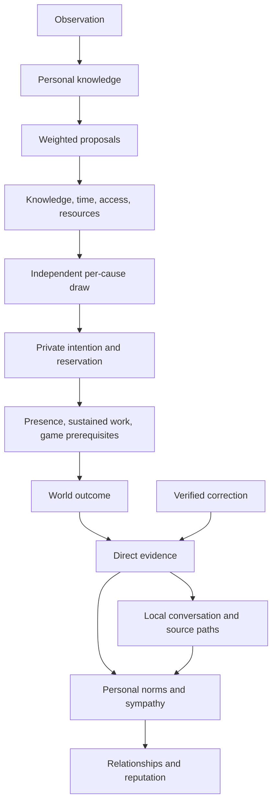

# Social decision boundaries

A character's private intention, an action in the world, and another person's interpretation are different facts. This layer keeps them separate. Policies suggest possibilities; named boundaries decide which possibilities are admissible. Randomness operates within those boundaries.

The implementation is a standalone C++17 module. It also has an opt-in adapter for `GameWorld` and `SimulationManager`. It requires no external service.



## State and authority

| State | Owner | Meaning |
| --- | --- | --- |
| Actor | World/host | Stable identity, physical state, personality, resources, personal limits |
| Contract | World ledger | A request, promise, appointment, or customary duty with a deadline |
| Knowledge | Individual | When the person learned about the duty, confidence, and source path |
| Intention | Actor | Fulfill, send support, or decline; intent alone is not completed work |
| Belief | Individual | An outcome version, confidence, evidence origin, and interpretation |
| Opinion ledger | Social system | The contribution already applied for one observer and cause |

Opening a duty informs its beneficiary. The actor must learn it through `inform` or conversation. No proposal can pass the knowledge boundary without adequate notice. A missed duty cannot generate blame when its actor did not learn about it in time.

Declining is private. It becomes a missed duty at the deadline rather than broadcasting an instantaneous reputation penalty. Physical fulfillment reserves effort, requires arrival, and can require uninterrupted work. Remote support consumes a fraction of the effort and earns partial credit; the contract may forbid it.

The actor knows their own resolved outcome when they knew the duty, but does not create a self-opinion. Other characters need direct observation or local conversation. Gossip cannot change the world outcome or reserve resources.

Observers do not apply identical judgments. Responsibility controls the strength of a social norm; affinity toward the beneficiary changes sympathy. The same evidence can therefore have different effects on different relationships. This initial model represents duties and their consequences; the game supplies the situations that create those duties.

## Decisions inside boundaries

`DecisionBoundary` evaluates named guards without changing state. A report contains each proposal's rejection reasons and an optional selected proposal. Invalid contexts, duplicate action IDs, and nonpositive or nonfinite weights fail closed. A policy cannot override a hard constraint by increasing a weight.

The social boundary checks that:

- The contract is open, both participants are alive, and its deadline has not passed.
- The actor has timely personal knowledge.
- The action is supported and allowed by the contract.
- The actor is available and has enough unreserved effort.
- Physical contact respects the actor's personal affinity limit.
- Travel and work can fit before the deadline, and the host's reachability rule permits the route.

`commit` rejects stale or forged reports and reevaluates external relationship and routing inputs. `complete` rechecks presence, availability, effort, personal limits, contact, and game prerequisites. Use `setFulfillmentRule` for tools, skills, ownership, or other game requirements. Rules and proposal callbacks must be pure.

Each action receives a draw keyed by seed, cause, actor, target, and action ID. Proposal ordering and unrelated random calls cannot move that draw. A weighted exponential race selects among admissible proposals. `reconsider` releases a private reservation and reopens the duty; unchanged inputs keep the same choice rather than allowing repeated rerolls.

Use stable, unique cause IDs. Do not reuse IDs after retirement. Actor names are unique and immutable because the existing relationship and reputation systems use names as keys. The same seed and inputs reproduce a decision on the same floating-point implementation. This module does not guarantee identical whole-world results across different frame schedules or platforms.

## Standalone use

```cpp
#include "npc/social/social_contract_system.hpp"
#include <cassert>

npc::SocialContractSystem social(42);
npc::SocialActor alice;
alice.id = 1; alice.name = "Alice"; alice.position = {1, 1};
npc::SocialActor morgan;
morgan.id = 2; morgan.name = "Morgan"; morgan.position = {2, 1};
assert(social.upsertActor(alice));
assert(social.upsertActor(morgan));

npc::SocialContract duty;
duty.id = 100; duty.actor = alice.id; duty.beneficiary = morgan.id;
duty.topic = "join the communal repair shift";
duty.openedAt = social.time(); duty.deadline = social.time() + 4;
duty.workDuration = 0.5;
assert(social.open(duty));
assert(social.inform(alice.id, duty.id));

auto report = social.decide(duty.id);
if (report.selected) social.commit(report);
social.advanceTo(0.1);
social.complete(duty.id); // Starts work if the actor chose fulfillment.
```

The host advances a monotonic clock and updates physical actor state. Starting a nonzero-duration job does not complete it. Continue calling `complete` after advancing time; interruptions reset work progress. One actor cannot perform two sustained jobs simultaneously. The standalone module does not move actors.

`inform` is an authoritative perception/dialogue input. Call it when an observation actually occurs. `observeOutcome` requires local contact with the beneficiary and respects the contact rule. `excuse` accepts host-verified evidence for a missed duty. The beneficiary and an informed actor learn the correction immediately; others retain their older belief until new evidence reaches them.

Conversation uses spatial neighbors, availability, contact rules, trust, and confidence decay. A wave reads one snapshot, so newly heard news waits until the next wave. Source paths cannot cycle, and hop limits bound forwarding. Newer evidence wins; for the same version, first-hand evidence wins over hearsay. Each wave has a monotonic epoch and can run only once.

Conversations have finite attention. Each sender selects a seed-keyed subset of at most `maxTopicsPerContact` topics per wave before contacting nearby people. The default is eight; old news that cannot improve the receiver's evidence is skipped. Topic selection changes with the epoch, so characters do not broadcast their entire memory at every encounter.

Applied opinion contributions persist after belief expiry. Hearing an expired or repeated report cannot farm reputation. Corrections apply only the difference from the previous contribution. Separate underlying totals preserve the correct difference even when a displayed reputation has reached its -100 or 100 limit.

## World integration

```cpp
world.enableSocialSimulation();
auto& social = world.social();
// Add duties and perception inputs through social.
world.update(dt);
```

Enable the adapter after registering NPCs. `SimulationManager::update` also runs the social step after its LOD ticks. Physical NPC state is synchronized before decisions. The adapter selects at most one new intention per actor per step, ordered by deadline and then cause ID.

The adapter supplies `social_contract` and `social_intent` blackboard values, calls `moveTo`, follows a moving beneficiary, and checks walls and path reachability. Combat, urgent needs, or `social_available = false` make an actor unavailable. A paused actor retains the reservation until reconsideration, cancellation, or deadline. Existing behavior code should coordinate its movement through these blackboard values.

One effort unit corresponds to 100 stamina points. Spent effort is applied from authoritative state, independently of the bounded audit queue. Direct and hearsay knowledge become NPC memories with source, reliability, timestamp, and hop count. Typed `SocialEvent` values go through the world event bus.

`GameWorld` cannot be copied or moved because its hooks capture its address. Keep the world alive longer than its simulation manager. Social relationships and reputation are available through `world.social()`; the host should use that graph when configuring this module's relationships.

## Save and load

Include `npc/serialization/social_serializer.hpp` and use `SocialSerializer::toJson` / `fromJson`. The versioned snapshot includes actors, contracts, partially completed work, reservations, knowledge, belief paths, gossip epoch, opinion contributions, and the relationship/reputation graphs. Seeds and cause IDs use decimal strings to preserve all 64 bits; clocks retain double precision.

Loading builds and validates a temporary system before replacing the live one. Failure leaves the current system intact. Success invalidates old decision reports and preserves installed policy/contact/reachability/fulfillment callbacks. Audit events are not replayed on load.

Register it as a custom section in the existing save system:

```cpp
npc::WorldSaveGame save;
save.addSection("social",
    [&] { return npc::SocialSerializer::toJson(social); },
    [&](const auto& data) {
        std::string error;
        if (!npc::SocialSerializer::fromJson(social, data, &error))
            throw std::runtime_error(error);
    });
```

Atomic validation applies to the social section. `WorldSaveGame` does not provide a transaction across all other sections. Restore NPCs and world time alongside social state before resuming world synchronization.

## Bounds and scheduling

Configuration limits actors, contracts, per-actor evidence, audit events, and gossip hops. Default limits are 1,024 actors, 4,096 contracts, 256 knowledge records per actor, 1,024 queued events, and six hops. Capacity checks reject new records rather than silently granting knowledge. The audit queue drops its oldest event when full; drain it regularly if every event must reach an external consumer.

Set the notice window before opening duties. It cannot change while contracts are retained, because timely notice is part of their history. Changes to evidence confidence and hop limits must remain compatible with retained knowledge and beliefs.

After evidence lifetime elapses, `retire` removes a resolved cause and its evidence while retaining historical relationship/reputation effects. Despawn cancels live duties and retains identity/history. Retained identities count toward the actor limit. The module is single-threaded; callers serialize access.

The world adapter performs one conversation wave per observed simulation hour. A large time step skips intervening conversations. Existing NPC movement remains frame-stepped. Hosts needing a fixed conversation cadence should advance in bounded steps or schedule standalone waves explicitly.

## Verification

```sh
cmake -B build -DCMAKE_BUILD_TYPE=Release -DNPC_LUA_BRIDGE=OFF -DNPC_BENCHMARKS=ON
cmake --build build --parallel
ctest --test-dir build --output-on-failure
./build/social_contract_demo 42
./build/social_contract_demo 7
./build/social_benchmarks
```

The demonstration is a communal repair shift with friendly and hostile relationships. Its outcomes emerge from the policies and boundaries. The regression suites exercise decisions, resources, physical work, evidence propagation and correction, world/lifecycle integration, and malformed-save rejection. The benchmark reports decision/resolution time and ten conversation waves at 64, 256, and 1,024 actors. It measures this subsystem, not full-game frame time.
